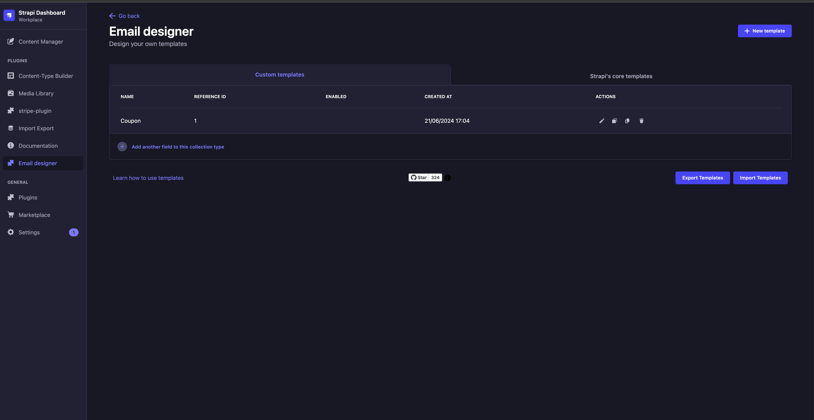
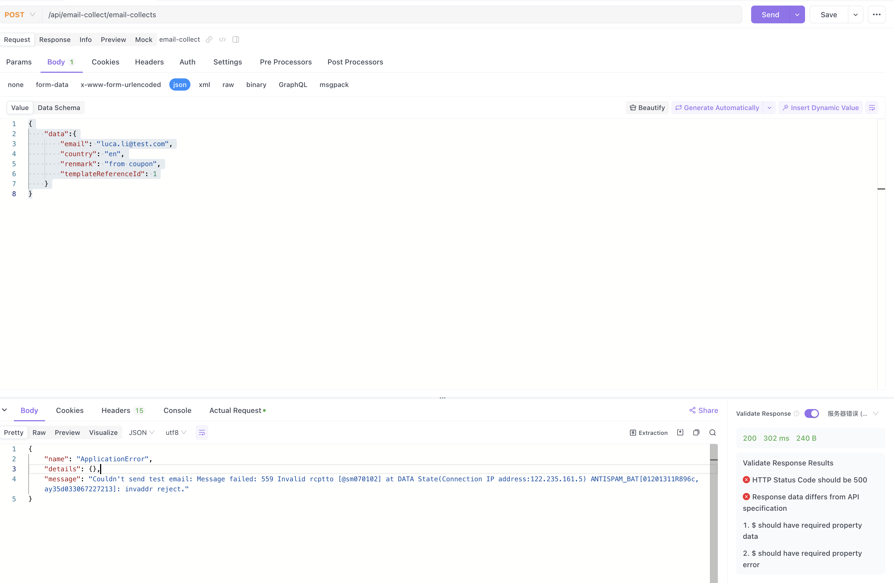
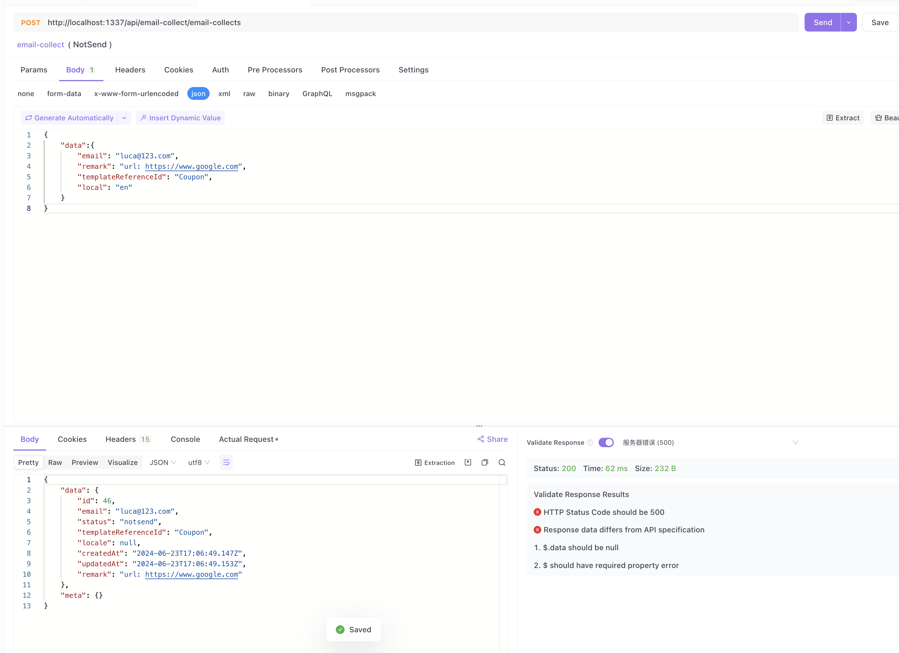

# Strapi邮件发送收集插件

[](https://npmjs.com/package/strapi-plugin-email-collect)
[](https://npmjs.com/package/strapi-plugin-email-collect)
[](https://gitHub.com/Liar0320/strapi-plugin-email-collect)
[](https://gitHub.com/Liar0320/strapi-plugin-email-collect/issues/)
[](https://gitHub.com/Liar0320/strapi-plugin-email-collect/actions)


## 前提条件
1. 安装 @strapi/provider-email-nodemailer 插件
> [文档地址](https://market.strapi.io/providers/@strapi-provider-email-nodemailer)
```bash
yarn add @strapi/provider-email-nodemailer
```

2. 配置邮件发送参数
```bash
# file location .env
SMTP_HOST=smtpdm.aliyun.com
SMTP_PORT=465
SMTP_USERNAME=luca.li@test.com #'luca <luca.li@test.com>'
SMTP_PASSWORD=123456
```
```js
// file location config/plugins.ts
module.exports = ({ env }) => ({
  email: {
    config: {
      provider: "nodemailer",
      providerOptions: {
        host: env("SMTP_HOST", "smtp.example.com"),
        port: env("SMTP_PORT", 587),
        auth: {
          user: env("SMTP_USERNAME"),
          pass: env("SMTP_PASSWORD"),
        },
        // ... any custom nodemailer options
      },
      settings: {
        defaultFrom: env("SMTP_USERNAME"),
        defaultReplyTo: env("SMTP_USERNAME"),
      },
    },
}})
```

2. 安装 strapi-plugin-email-designer 插件
> [文档地址](https://market.strapi.io/plugins/strapi-plugin-email-designer)
```bash
yarn add strapi-plugin-email-designer@latest
```

3. 安装 strapi-plugin-email-collect 插件
```bash
yarn add strapi-plugin-email-collect
```

4. 重启strapi服务
```bash
yarn build
yarn develop
```

## 使用方法

### 向用户发送邮件
1. 在后台管理界面创建邮件模板
获取templateReferenceId

2. 发送邮件
将templateReferenceId设置为对应的模板id


### 只进行收集邮件，不发送邮件
1. 将templateReferenceId设置为-1即可
