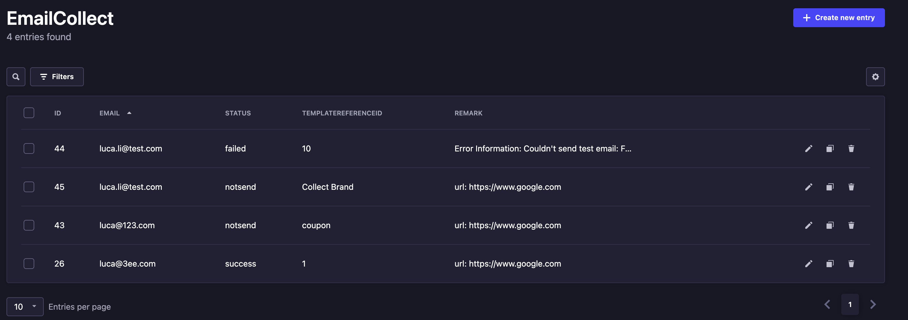
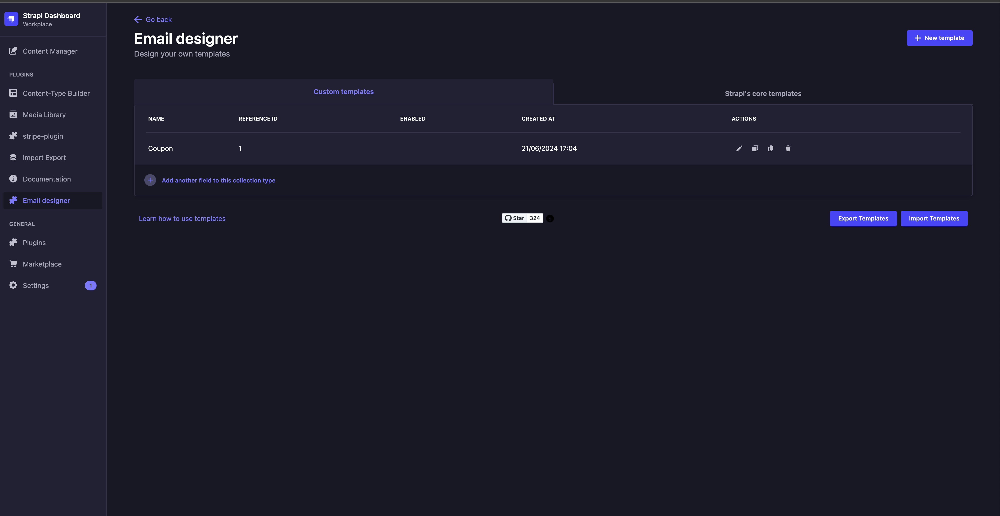
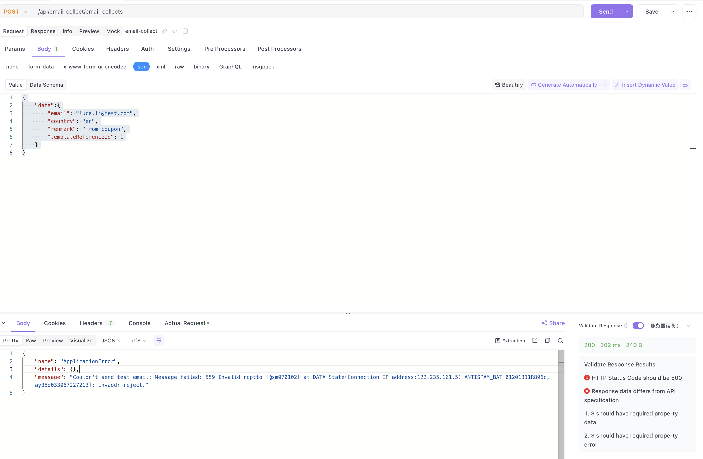
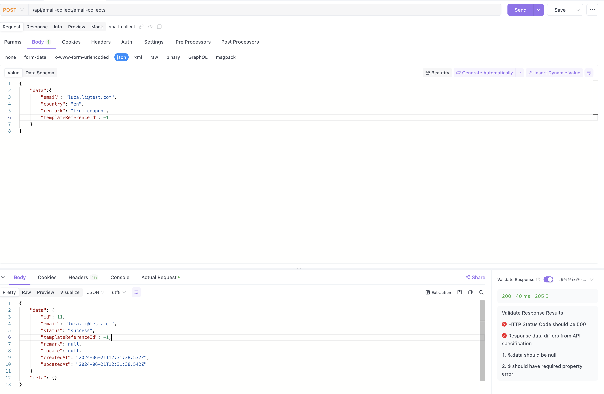

# Strapi Email Sending Collect Plugin

[](https://npmjs.com/package/strapi-plugin-email-collect)
[](https://npmjs.com/package/strapi-plugin-email-collect)
[](https://gitHub.com/Liar0320/strapi-plugin-email-collect)
[](https://gitHub.com/Liar0320/strapi-plugin-email-collect/issues/)
[](https://gitHub.com/Liar0320/strapi-plugin-email-collect/actions)



## Prerequisites

1. Install the @strapi/provider-email-nodemailer plugin
   > [Documentation](https://market.strapi.io/providers/@strapi-provider-email-nodemailer)
   ```bash
   yarn add @strapi/provider-email-nodemailer
   ```

2. Configure email sending parameters
   ```bash
   # file location .env
   SMTP_HOST=smtpdm.aliyun.com
   SMTP_PORT=465
   SMTP_USERNAME=luca.li@test.com #'luca <luca.li@test.com>'
   SMTP_PASSWORD=123456
   ```
   ```js
   // file location config/plugins.ts
   module.exports = ({ env }) => ({
     email: {
       config: {
         provider: "nodemailer",
         providerOptions: {
           host: env("SMTP_HOST", "smtp.example.com"),
           port: env("SMTP_PORT", 587),
           auth: {
             user: env("SMTP_USERNAME"),
             pass: env("SMTP_PASSWORD"),
           },
           // ... any custom nodemailer options
         },
         settings: {
           defaultFrom: env("SMTP_USERNAME"),
           defaultReplyTo: env("SMTP_USERNAME"),
         },
       },
     },
   });
   ```

3. Install the strapi-plugin-email-designer plugin
   > [Documentation](https://market.strapi.io/plugins/strapi-plugin-email-designer)
   ```bash
   yarn add strapi-plugin-email-designer@latest
   ```

4. Install the strapi-plugin-email-collect plugin
   ```bash
   yarn add strapi-plugin-email-collect
   ```

5. Restart the Strapi service
   ```bash
   yarn build
   yarn develop
   ```

## Usage

### Send emails to users

1. Create an email template in the admin panel
   Get the `templateReferenceId`
   

2. Send an email
   Set the `templateReferenceId` to the corresponding template id
   

### Only collect emails without sending them

1. Set the `templateReferenceId` to -1
   